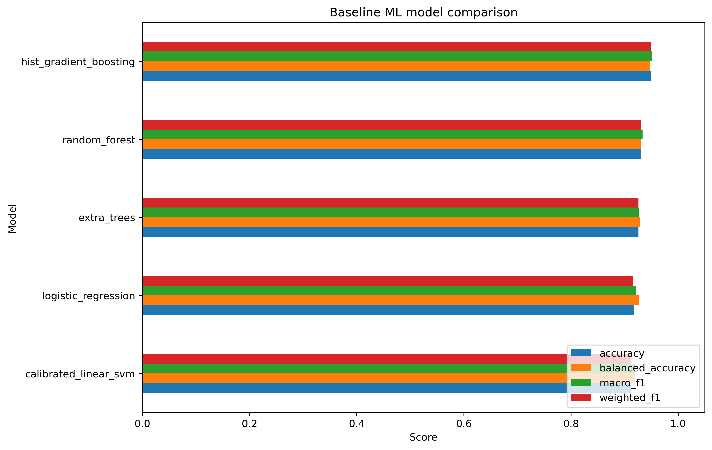
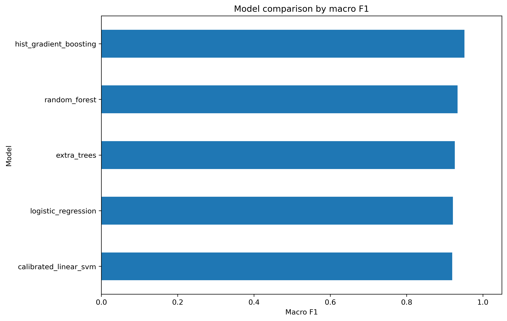
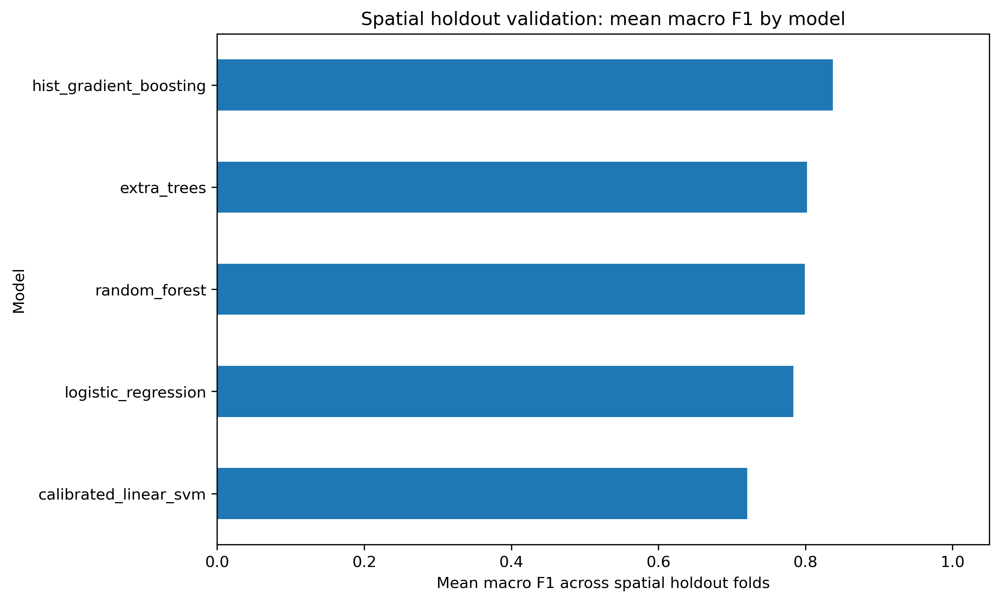
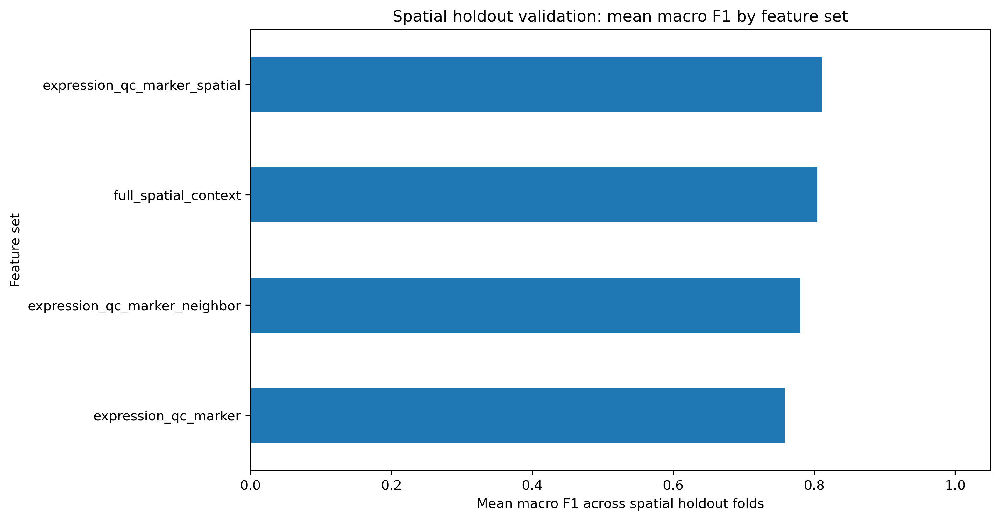
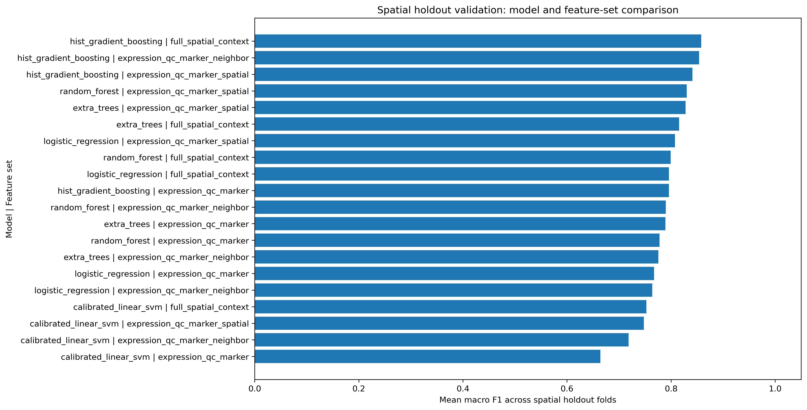
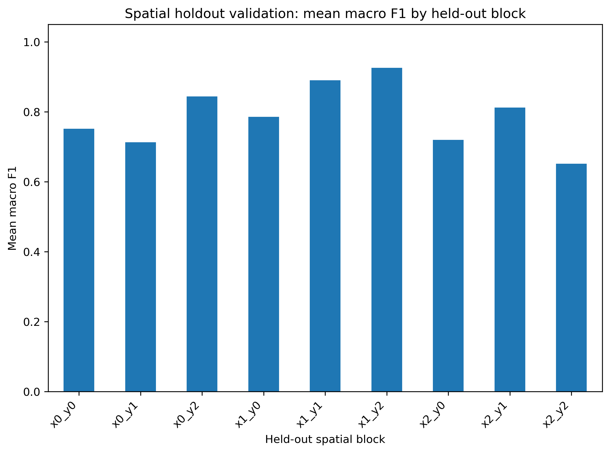

# SpatialNicheAI: Interpretable ML for breast cancer spatial transcriptomics

SpatialNicheAI is an end-to-end bioinformatics and machine learning project that analyzes a public 10x Genomics Visium breast cancer dataset to classify spatial tumor microenvironment niches.

The project combines:

- 10x Visium spatial transcriptomics analysis
- Scanpy and Squidpy-based spatial analysis
- marker-gene-based biological interpretation
- manual biological niche annotation
- supervised machine learning
- five-model ML comparison
- spatial holdout validation across tissue blocks
- Docker reproducibility
- AWS EC2 + S3 cloud execution

The goal is to show how spatial transcriptomics can reveal biologically meaningful regions in breast cancer tissue and how those annotations can be converted into an interpretable ML workflow.

---

## Project Overview

Breast tumors are spatially heterogeneous. Tumor epithelial regions, luminal/secretory regions, immune niches, stromal-like regions, adipose tissue, and metabolically stressed tumor regions can occupy different areas of the same tissue section.

This project asks:

> 1) Can spatial transcriptomics identify biologically meaningful breast cancer tissue niches?
> 2) Can machine learning learn to classify those niches from expression-derived and spatial-context features?

The workflow starts with public 10x Visium data and produces annotated spatial niche maps, marker-gene evidence. It then moves to ML model comparisons, spatial holdout validation, Dockerized execution, and AWS cloud execution documentation.

---

## Dataset

Primary dataset:

- **10x Genomics Human Breast Cancer: Visium Fresh Frozen, Whole Transcriptome**
- Invasive ductal carcinoma
- ER positive, PR negative, HER2 2+
- Spatial gene expression data generated with 10x Genomics Visium

Dataset page:

    https://www.10xgenomics.com/datasets/human-breast-cancer-visium-fresh-frozen-whole-transcriptome-1-standard

Large raw data files are not committed to GitHub. They are downloaded locally or stored in S3 for cloud execution.

---

## Workflow Summary

    Public 10x Visium breast cancer data
            |
            v
    Load data and calculate QC metrics
            |
            v
    Filter spots, normalize counts, select highly variable genes
            |
            v
    PCA, UMAP, Leiden clustering
            |
            v
    Squidpy spatial neighbor graph
            |
            v
    Differential expression, marker analysis, Moran's I, neighborhood enrichment
            |
            v
    Manual biological niche annotation
            |
            v
    Five-model supervised ML comparison
            |
            v
    Random split validation + spatial holdout validation
            |
            v
    Dockerized local workflow + AWS EC2/S3 execution

---

## Repository Structure

    Spatial_Breast_Cancer_AI_project/
    ├── README.md
    ├── Dockerfile
    ├── environment.yml
    ├── data_manifest/
    │   └── annotations/
    │       └── leiden_r06_manual_cluster_annotations.csv
    ├── docs/
    │   ├── figures/       # selected README figures
    │   └── tables/        # selected summary tables
    ├── src/
    │   ├── preprocessing/
    │   │   ├── 01_load_visium_qc.py
    │   │   └── 02_preprocess_cluster.py
    │   ├── analysis/
    │   │   ├── 03_marker_gene_analysis.py
    │   │   └── 04_apply_manual_annotations.py
    │   └── modeling/
    │       ├── 05_train_baseline_niche_classifier.py
    │       └── 06_spatial_holdout_validation.py
    ├── workflows/
    │   └── run_local_pipeline.sh
    ├── aws/
    │   └── EC2_S3_RUNBOOK.md
    ├── data/       # ignored; local raw/processed data
    ├── results/    # ignored except selected committed summaries
    └── models/     # ignored except selected committed metadata

---

## Biological Interpretation

Leiden clusters were interpreted using:

- cluster-level differential expression
- known breast cancer and tumor microenvironment marker genes
- spatial marker expression patterns
- Squidpy spatial neighborhood enrichment
- Moran's I spatial autocorrelation
- manual biological review

High-confidence spatial niche labels included:

- **Tumor epithelial**
- **Hypoxic/metabolic tumor-like**
- **Keratin-high tumor epithelial**
- **Luminal/stress-like epithelial**
- **Luminal/secretory epithelial**
- **Antigen-presenting myeloid/APC**
- **B-cell/plasma-cell immune**

Low-confidence, mixed, rare, or review-needed clusters were excluded from supervised ML training.

### Key biological observations

The spatial niche map suggests several biologically meaningful tissue regions:

- Tumor epithelial and keratin-high tumor regions form coherent spatial domains rather than random scattered spots.
- A hypoxic/metabolic tumor-like region appears near tumor-associated epithelial regions, suggesting localized metabolic stress within the tumor area.
- Immune-associated regions include antigen-presenting myeloid/APC-like areas and B-cell/plasma-cell-enriched areas.
- Luminal/secretory epithelial regions are supported by breast-associated markers such as `SCGB2A2`, `SCGB1D2`, `GATA3`, and `XBP1`.
- Mixed epithelial/stromal-like and rare epithelial/neural-like clusters were treated cautiously and excluded from high-confidence ML training.

These interpretations are based on marker genes such as:

| Niche | Example markers |
|---|---|
| Tumor epithelial | EPCAM, KRT8, KRT18, KRT19, MUC1 |
| Luminal/secretory | SCGB2A2, SCGB1D2, GATA3, XBP1 |
| Myeloid/APC | CD74, HLA-DRA, HLA-DPA1, C1QA, C1QB, LYZ |
| B-cell/plasma-cell immune | IGKC, IGHG1, IGHG3, IGLC2, JCHAIN |
| Stromal/CAF | COL1A1, COL1A2, DCN, LUM, ACTA2 |
| Adipocyte/fat-associated | FABP4, PLIN1, ADIPOQ, LPL, CFD |
| Hypoxia/glycolysis | GAPDH, PGK1, TPI1, ENO1, LDHA |
| Proliferation | MKI67, TOP2A, PCNA, MCM5 |

---

## Machine Learning Results

The supervised ML task used manually curated high-confidence spatial niche labels as weak supervision. Low-confidence, mixed, rare, or review-needed clusters were excluded from model training.

### Features

The ML feature table included:

- PCA coordinates from normalized expression
- QC metrics
- spatial coordinates
- marker signature scores for tumor, immune, myeloid/APC, stromal, adipocyte, proliferation, hypoxia/glycolysis, and luminal/secretory programs
- Squidpy-derived spatial-neighborhood marker-score features

The Squidpy neighborhood features summarize the average marker-signature activity of neighboring Visium spots. This adds local tissue context while keeping the features interpretable.

### Models compared

Five supervised classifiers were compared:

- Logistic regression
- Calibrated linear SVM
- Random forest
- Extra trees
- Histogram gradient boosting

### Random split performance

Under a stratified random spot-level split, histogram gradient boosting performed best.

| Model | Accuracy | Balanced Accuracy | Macro F1 | Weighted F1 |
|---|---:|---:|---:|---:|
| Histogram gradient boosting | 0.9492 | 0.9479 | 0.9518 | 0.9491 |
| Random forest | 0.9307 | 0.9303 | 0.9336 | 0.9307 |
| Extra trees | 0.9261 | 0.9286 | 0.9264 | 0.9260 |
| Logistic regression | 0.9168 | 0.9264 | 0.9215 | 0.9167 |
| Calibrated linear SVM | 0.9131 | 0.9196 | 0.9196 | 0.9131 |

The trained best model was also used to predict labels across all Visium spots, including low-confidence/review regions.

### Interpretation

The random-split results show that manually annotated spatial niches can be predicted from expression-derived, marker-signature, QC, and spatial-context features. However, random spot-level splits can overestimate model performance in spatial transcriptomics because neighboring spots are often correlated. For that reason, spatial holdout validation was also performed.

---

## Spatial Holdout Validation

Random spot-level train/test splits can overestimate performance in spatial transcriptomics because neighboring spots may share similar expression profiles, tissue morphology, cell-type composition, and technical effects.

To test robustness more realistically, the tissue was divided into a **3 × 3 spatial grid**, and models were evaluated using leave-one-spatial-block-out validation.

### Spatial holdout design

The spatial holdout workflow evaluated:

    5 models × 4 feature sets × 9 spatial blocks = 180 validation folds

The four feature sets were:

| Feature set | Included features |
|---|---|
| `expression_qc_marker` | PCA + QC + marker scores |
| `expression_qc_marker_spatial` | PCA + QC + marker scores + spatial coordinates |
| `expression_qc_marker_neighbor` | PCA + QC + marker scores + Squidpy neighbor marker scores |
| `full_spatial_context` | PCA + QC + marker scores + spatial coordinates + Squidpy neighbor marker scores |

### Spatial holdout results

Histogram gradient boosting remained the strongest overall model under spatial holdout validation, supporting a stronger generalization claim than the random split alone.

Mean spatial-holdout accuracy by model:

| Model | Mean Accuracy |
|---|---:|
| Histogram gradient boosting | 0.9283 |
| Extra trees | 0.9163 |
| Random forest | 0.9150 |
| Logistic regression | 0.9049 |
| Calibrated linear SVM | 0.8870 |

Mean spatial-holdout accuracy by feature set:

| Feature set | Mean Accuracy |
|---|---:|
| `expression_qc_marker_spatial` | 0.9120 |
| `expression_qc_marker_neighbor` | 0.9104 |
| `full_spatial_context` | 0.9098 |
| `expression_qc_marker` | 0.9089 |

### Interpretation

Spatial holdout validation showed that performance depends on tissue-region composition and label balance. Some held-out regions were easier because they contained clearer niche structure, while mixed or label-diverse regions were more difficult.

The fact that histogram gradient boosting remained strong under spatial holdout suggests that the model learned biologically meaningful expression and marker-signature patterns rather than only memorizing random spot-level structure. Still, this is a single-sample validation. True generalization should eventually be tested on additional breast cancer Visium sections or external spatial transcriptomics datasets.

---

## How to Run the Project

### 1. Clone the repository

    git clone git@github.com:misaell2/Spatial_Breast_Cancer_AI_project.git
    cd Spatial_Breast_Cancer_AI_project

### 2. Download the 10x Visium dataset

Create the expected data folder:

    mkdir -p data/raw/10x/Visium_Human_Breast_Cancer
    cd data/raw/10x/Visium_Human_Breast_Cancer

Download the public 10x files:

    BASE="https://cf.10xgenomics.com/samples/spatial-exp/1.3.0/Visium_Human_Breast_Cancer"

    curl -L --fail --retry 3 -O "$BASE/Visium_Human_Breast_Cancer_filtered_feature_bc_matrix.h5"
    curl -L --fail --retry 3 -O "$BASE/Visium_Human_Breast_Cancer_spatial.tar.gz"

    tar -xzf Visium_Human_Breast_Cancer_spatial.tar.gz

Return to the repo root:

    cd ../../../../

Expected layout:

    data/raw/10x/Visium_Human_Breast_Cancer/
    ├── Visium_Human_Breast_Cancer_filtered_feature_bc_matrix.h5
    ├── Visium_Human_Breast_Cancer_spatial.tar.gz
    └── spatial/

### 3. Run locally with Docker

Build the Docker image:

    docker build -t spatial-bc-ai:local .

Test the environment:

    docker run --rm spatial-bc-ai:local

Run the full workflow:

    docker run --rm \
      -v "$PWD":/workspace \
      -w /workspace \
      spatial-bc-ai:local \
      bash workflows/run_local_pipeline.sh

Generated outputs will be written to:

    data/processed/
    results/
    models/

These folders are mostly ignored by Git, except for selected lightweight summary outputs used in the README.

---

## AWS Cloud Execution

The Dockerized workflow was successfully executed on AWS EC2 using S3 for cloud storage.

Completed AWS components:

- uploaded raw 10x Visium input data and annotation manifests to S3
- launched an Ubuntu EC2 instance for cloud compute
- attached an IAM role to EC2 for secure S3 access
- cloned the GitHub repository onto EC2 using SSH
- built the project Docker image on EC2
- ran the full end-to-end workflow inside Docker
- synced generated results, trained models, logs, and processed AnnData files back to S3

Completed AWS run:

    RUN_ID=ec2_run_20260602_170837

The AWS workflow is documented in:

    aws/EC2_S3_RUNBOOK.md

The live AWS resources were not kept running after the milestone to avoid ongoing cloud charges.

---

## Reproducibility Notes

Large generated files are intentionally excluded from Git tracking:

    data/
    results/
    models/
    *.h5ad
    *.h5
    *.tar.gz
    *.joblib

Selected lightweight figures and summary tables are copied into `docs/` for GitHub display.

This keeps the repository readable while preserving a reproducible workflow.

---

## Current Status

Completed:

- 10x Visium breast cancer data loading and QC
- Scanpy/Squidpy preprocessing and spatial neighbor graph construction
- Leiden clustering
- marker-gene analysis
- Moran's I spatial autocorrelation
- Squidpy neighborhood enrichment
- manual biological niche annotation
- five-model ML classification
- spatial holdout validation across models and feature sets
- Dockerized reproducible workflow
- AWS EC2 + S3 workflow execution
- GitHub documentation with selected figures and results

Planned extensions:

- pathway enrichment analysis
- external validation on additional breast cancer spatial transcriptomics samples
- TCGA-BRCA signature comparison
- single-cell reference deconvolution
- AWS Batch, ECR, or Terraform workflow upgrades

---

## License and Use

This repository is released under the MIT License.

This project is intended for research, education, and portfolio demonstration purposes. It is not intended for clinical diagnosis, treatment selection, or medical decision-making.

Users are responsible for complying with the terms of use of any external datasets analyzed with this code.

---

## References and Related Work

### Dataset

10x Genomics. Human Breast Cancer: Visium Fresh Frozen, Whole Transcriptome.

    https://www.10xgenomics.com/datasets/human-breast-cancer-visium-fresh-frozen-whole-transcriptome-1-standard

### Spatial transcriptomics analysis

Scanpy spatial transcriptomics tutorial.

    https://scanpy.readthedocs.io/en/stable/tutorials/spatial/basic-analysis.html

Scanpy `read_visium` documentation.

    https://scanpy.readthedocs.io/en/stable/api/scanpy.read_visium.html

Squidpy documentation.

    https://squidpy.readthedocs.io/

Squidpy spatial plotting.

    https://squidpy.readthedocs.io/en/stable/api/squidpy.pl.spatial_scatter.html

Squidpy spatial neighbors.

    https://squidpy.readthedocs.io/en/stable/api/squidpy.gr.spatial_neighbors.html

### Related spatial transcriptomics methods

SpaceMarkers: molecular interaction analysis from spatial transcriptomics.

    https://www.sciencedirect.com/science/article/pii/S2405471223000807

TESLA: machine learning framework for tissue annotation from spatial transcriptomics.

    https://pmc.ncbi.nlm.nih.gov/articles/PMC10246692/

### Future validation resource

TCGA-BRCA project page.

    https://portal.gdc.cancer.gov/projects/TCGA-BRCA

---

## Author

**Misael Lazaro**

Bioinformatics and computational biology researcher with experience in NGS analysis, RNA-seq, ChIP-seq, genome assembly, spatial transcriptomics, clinical variant interpretation, Python/R software development, machine learning, and cloud/HPC bioinformatics workflows.
