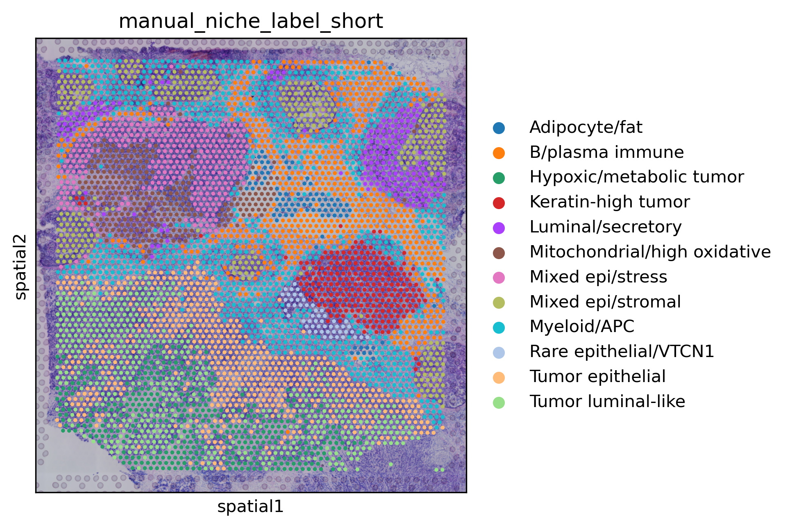
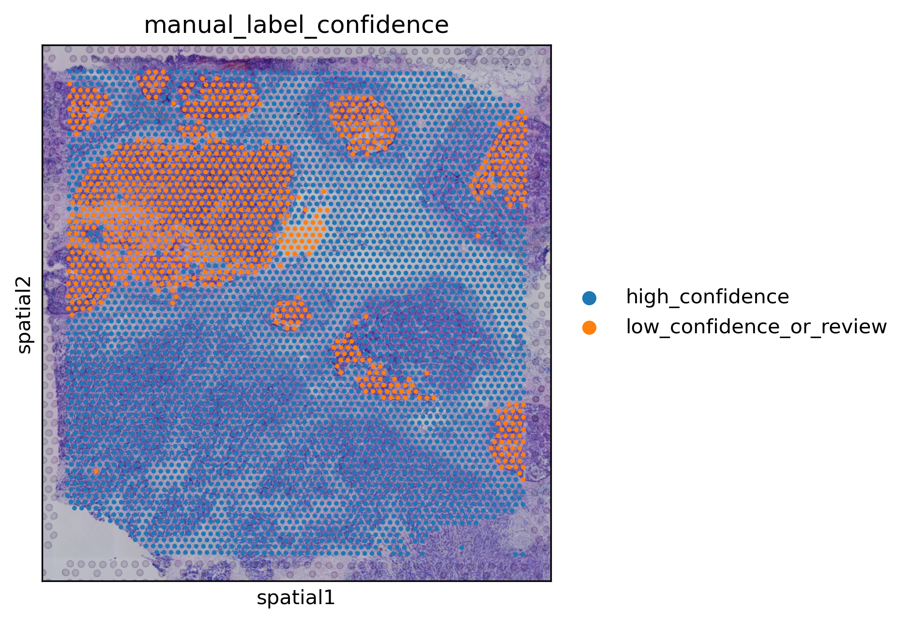
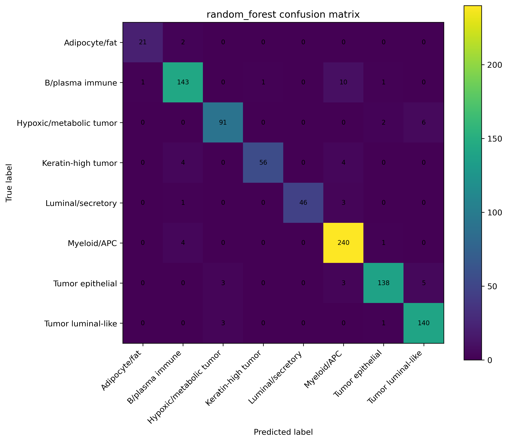
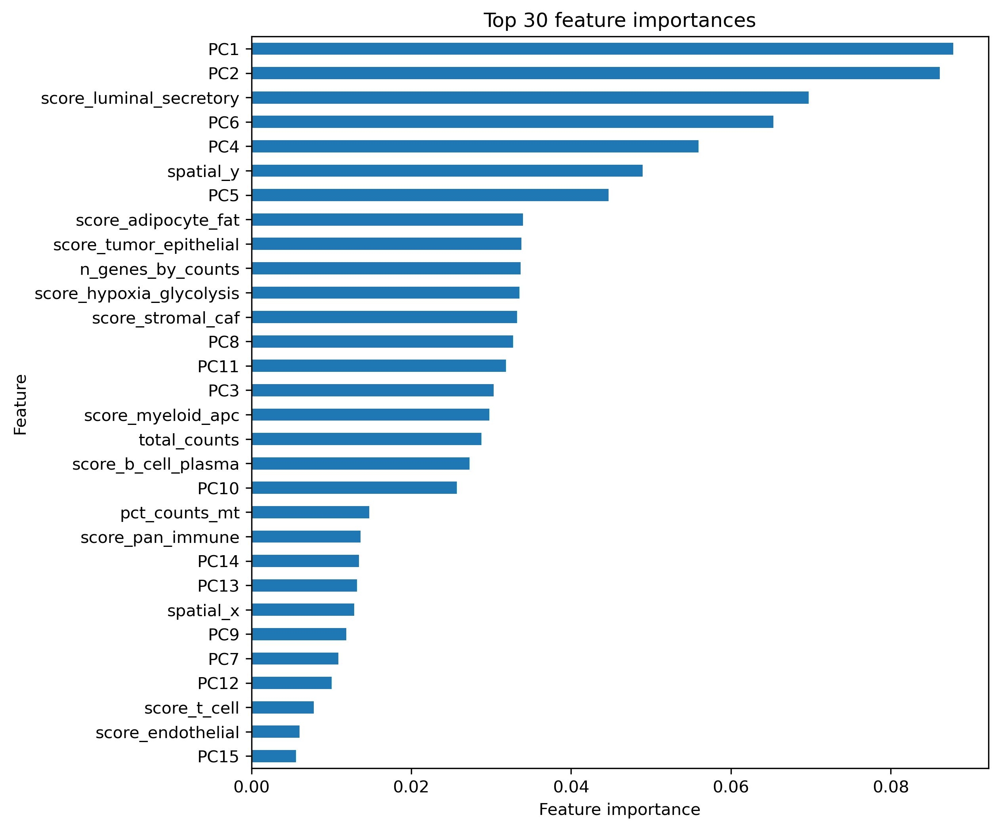
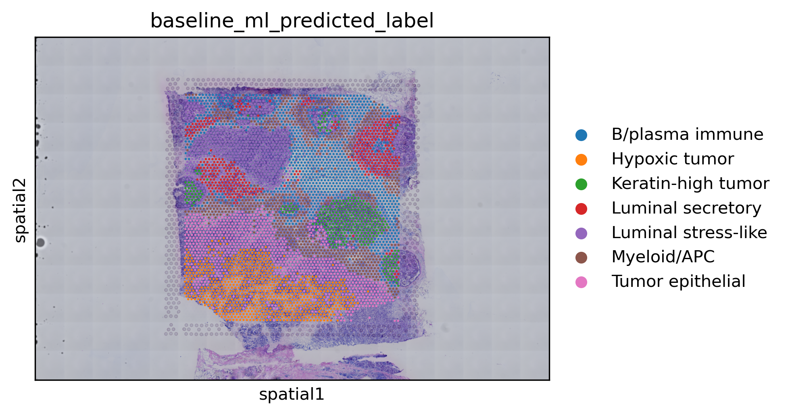
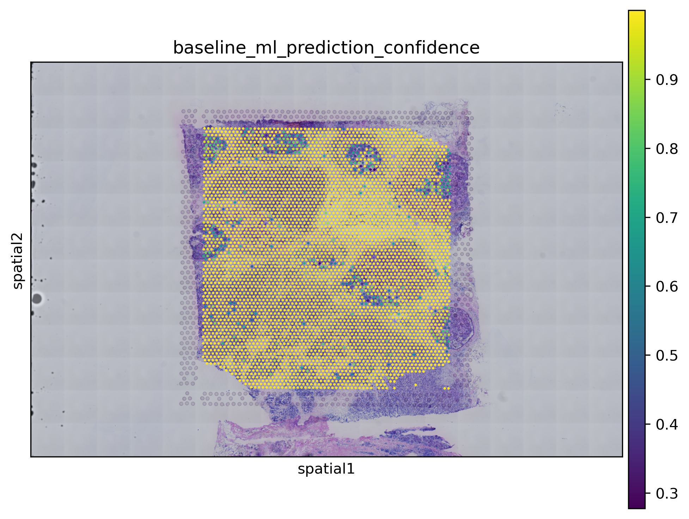
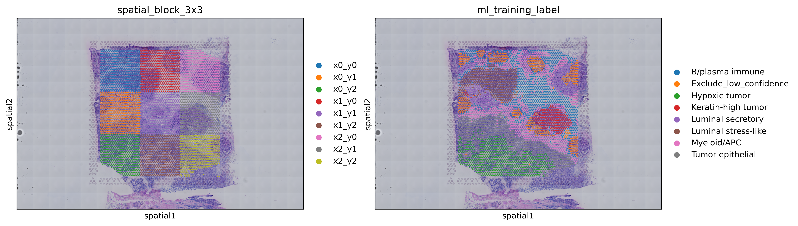
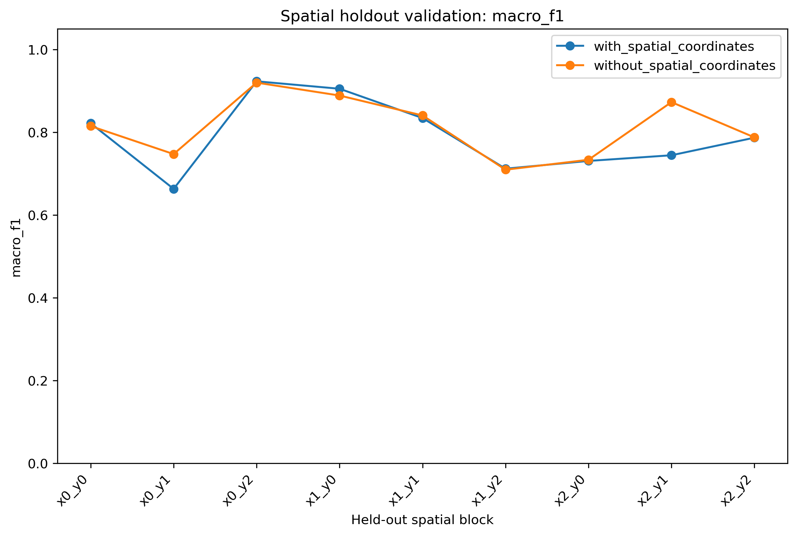

# Spatial_Breast_Cancer_AI_project

## SpatialNicheAI: Interpretable ML for breast cancer spatial transcriptomics

This project uses public 10x Genomics Visium breast cancer spatial transcriptomics data to identify, interpret, and classify biologically meaningful tumor microenvironment niches.

The long-term goal is to build a reproducible cloud-ready workflow that can analyze spatial transcriptomics data, assign interpretable tissue niche labels, train weakly supervised machine learning models, and evaluate model robustness using spatially aware validation.

---

## Project Motivation

Breast tumors are spatially heterogeneous. Tumor epithelial cells, immune cells, stromal fibroblasts, adipose regions, and metabolically active tumor regions can occupy distinct regions within the same tissue section.

This project asks:

> Can spatial transcriptomics reveal distinct breast cancer tissue niches, and can machine learning automate the biological interpretation of those regions?

---

## Current Results Summary

This project currently includes:

- 10x Visium breast cancer data loading and QC
- conservative spot filtering
- normalization and highly variable gene selection
- PCA, UMAP, and Leiden clustering
- marker gene discovery by differential expression
- manual biological niche annotation
- baseline supervised ML classification
- spatial holdout validation

### Key ML Results

| Evaluation | Model | Accuracy | Balanced Accuracy | Macro F1 | Weighted F1 |
|---|---|---:|---:|---:|---:|
| Random split | Random forest | 0.9409 | 0.9277 | 0.9392 | 0.9407 |
| Random split | Logistic regression | 0.9247 | 0.9278 | 0.9275 | 0.9248 |

Spatial holdout validation showed more variable block-level performance than the random split baseline, which is expected for spatial transcriptomics data.

- With spatial coordinates: macro F1 ranged from approximately 0.66 to 0.92 across held-out spatial blocks.
- Without spatial coordinates: macro F1 ranged from approximately 0.71 to 0.92 across held-out spatial blocks.

This suggests that random spot-level splits can overestimate performance and that spatially aware validation is important for spatial transcriptomics ML workflows.

---

## Dataset

### Primary dataset

Public 10x Genomics Visium breast cancer dataset:

- **Human Breast Cancer: Visium Fresh Frozen, Whole Transcriptome**
- Invasive ductal carcinoma
- ER positive, PR negative, HER2 2+
- 10x Genomics public dataset
- Dataset URL: https://www.10xgenomics.com/datasets/human-breast-cancer-visium-fresh-frozen-whole-transcriptome-1-standard

### Planned validation dataset

- **TCGA-BRCA**
- Bulk RNA-seq and clinical metadata for breast cancer samples
- Accessed through the NCI Genomic Data Commons
- URL: https://portal.gdc.cancer.gov/projects/TCGA-BRCA

TCGA-BRCA validation is planned for a future milestone and is not yet part of the current results.

---

## Biological Questions

This project focuses on several biological questions:

1. What spatially distinct regions are present in breast cancer tissue?
2. Which marker genes define tumor, immune, stromal, adipose, and proliferative regions?
3. Can manually interpreted biological niches be predicted from expression-derived features?
4. Does model performance remain robust when entire spatial tissue regions are held out?
5. Can spatial niche signatures eventually be compared against TCGA-BRCA bulk RNA-seq data?

---

## Workflow Overview

```text
Public 10x Visium breast cancer data
        |
        v
Data loading and QC
        |
        v
Filtering, normalization, HVG selection
        |
        v
PCA, UMAP, Leiden clustering
        |
        v
Marker gene discovery
        |
        v
Manual biological niche annotation
        |
        v
Baseline ML model training
        |
        v
Random split and spatial holdout validation
        |
        v
Selected results copied to docs/ for GitHub display

## Repository Structure

```text
Spatial_Breast_Cancer_AI_project/
├── README.md
├── data_manifest/
│   └── annotations/
│       └── leiden_r06_manual_cluster_annotations.csv
├── docs/
│   ├── figures/
│   └── tables/
├── src/
│   ├── preprocessing/
│   │   ├── 01_load_visium_qc.py
│   │   └── 02_preprocess_cluster.py
│   ├── analysis/
│   │   ├── 03_marker_gene_analysis.py
│   │   └── 04_apply_manual_annotations.py
│   └── modeling/
│       ├── 05_train_baseline_niche_classifier.py
│       └── 06_spatial_holdout_validation.py
├── aws/
├── workflows/
├── tests/
├── data/       # ignored; local raw/processed data
├── results/    # ignored; generated analysis outputs
└── models/     # ignored; trained local model artifacts
```

---

## Manual Spatial Niche Annotation

Leiden clusters were interpreted using:

- cluster-level differential expression
- known breast cancer and tumor microenvironment marker genes
- spatial marker expression patterns
- manual biological review

High-confidence niche labels included:

- Antigen-presenting myeloid
- B-cell/plasma-cell immune
- Tumor epithelial
- Tumor luminal-like
- Hypoxic/metabolic tumor-like
- Keratin-high tumor
- Luminal/secretory epithelial
- Adipocyte/fat-associated

Lower-confidence, mixed, mitochondrial/high-oxidative, or review-needed clusters were excluded from supervised ML training.





---

## Marker Genes Used for Biological Interpretation

| Niche | Example markers |
|---|---|
| Tumor epithelial | EPCAM, KRT8, KRT18, KRT19, MUC1 |
| Myeloid/APC | CD74, HLA-DRA, HLA-DPA1, C1QA, C1QB, LYZ |
| B-cell/plasma-cell immune | IGKC, IGHG1, IGHG3, IGLC2, JCHAIN |
| T cells | CD3D, CD3E, CD8A, CD8B, TRAC |
| Stromal/CAF | COL1A1, COL1A2, DCN, LUM, ACTA2 |
| Adipocyte/fat-associated | FABP4, PLIN1, ADIPOQ, LPL, CFD |
| Hypoxia/glycolysis | GAPDH, PGK1, TPI1, ENO1, LDHA |
| Proliferation | MKI67, TOP2A, PCNA, MCM5 |

---

## Baseline Machine Learning Model

The first supervised model used manually annotated spatial niche labels as weak supervision.

### Input features

The baseline classifier used:

- PCA coordinates from normalized gene expression
- QC metrics
- spatial coordinates
- marker signature scores for tumor, immune, myeloid, stromal, adipocyte, proliferation, hypoxia/glycolysis, and luminal/secretory programs

### Models compared

- Logistic regression
- Random forest

### Random split performance

The random forest performed best in the random train/test split.





### Spatial ML predictions

The trained random forest was used to predict niche labels across all Visium spots, including low-confidence/review regions.





---

## Spatial Holdout Validation

Random spot-level train/test splits can overestimate model performance in spatial transcriptomics because neighboring spots are correlated.

To evaluate robustness more realistically, the tissue was divided into a 3 × 3 spatial grid and the model was evaluated using leave-one-spatial-block-out validation.



### Spatial holdout interpretation

Spatial holdout validation showed more variable performance than the random split baseline.

This suggests:

- the classifier captures meaningful expression and marker-signature patterns
- performance depends on tissue-region composition and label balance
- spatially aware validation is important for spatial transcriptomics ML workflows
- future validation should include additional breast cancer spatial transcriptomics samples



---

## Reproducibility Notes

Large data files, intermediate `.h5ad` files, trained models, and generated result folders are intentionally excluded from Git tracking.

Ignored local outputs include:

- `data/`
- `results/`
- `models/`
- `.h5ad` files
- downloaded 10x Genomics files

Selected lightweight figures and summary tables are copied into `docs/` for GitHub display.

---

## Related Work and Differentiation

Many public analyses use 10x Genomics human breast cancer Visium datasets for spatial transcriptomics tutorials, spatial domain detection, cell-type deconvolution, super-resolution, and tissue annotation.

This project differs by focusing on an end-to-end, portfolio-ready workflow that combines:

- reproducible spatial transcriptomics preprocessing
- marker-gene-driven biological interpretation
- manual niche annotation
- weakly supervised machine learning
- random split and spatial holdout validation
- planned AWS/cloud deployment

The goal is not only to cluster spatial transcriptomics data, but to build an interpretable and extensible system for automated spatial niche classification.

---

## Planned AWS Architecture

The project is being designed for future cloud deployment.

```text
Public datasets
      |
      v
AWS S3 raw data bucket
      |
      v
Dockerized analysis environment
      |
      v
EC2 / AWS Batch compute
      |
      v
Workflow orchestration
      |
      v
Preprocessing + feature engineering
      |
      v
ML model training and inference
      |
      v
Pathway enrichment + spatial analysis
      |
      v
Automated HTML report
      |
      v
AWS S3 results bucket
```

Planned AWS components:

- S3 for raw data, processed data, models, and reports
- EC2 for development and initial pipeline execution
- Docker for reproducible environments
- AWS Batch for scalable workflow execution
- ECR for container storage
- CloudWatch for logs and monitoring
- IAM roles for secure access
- Terraform for infrastructure-as-code

---

## Current Status

Completed:

- 10x Visium breast cancer data download and loading
- QC and spatial visualization
- preprocessing and Leiden clustering
- marker gene discovery
- manual niche annotation
- baseline ML classification
- spatial holdout validation
- GitHub documentation with selected figures and summary tables

In progress / planned:

- Dockerized reproducible workflow
- AWS EC2/S3 execution
- pathway enrichment analysis
- external validation on additional breast cancer spatial transcriptomics data
- TCGA-BRCA signature comparison

---

## Author

**Misael Lazaro**

Bioinformatics and computational biology researcher with experience in NGS analysis, RNA-seq, ChIP-seq, genome assembly, spatial transcriptomics, clinical variant interpretation, Python/R software development, machine learning, and cloud/HPC bioinformatics workflows.
