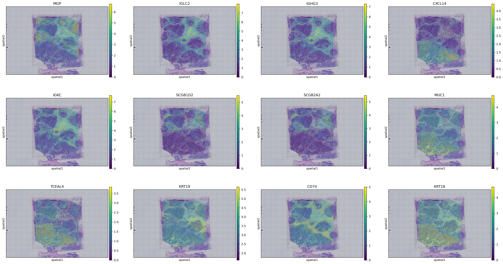

# SpatialNicheAI: Interpretable ML for breast cancer spatial transcriptomics

SpatialNicheAI is a reproducible bioinformatics and machine learning project for analyzing breast cancer spatial transcriptomics data. The project is divided into two parts; bioinformatics and machine learning. 

The birds eye view of the project:

> 1) What biological regions exist in this breast cancer tissue?
> 2) Can machine learning learn these spatial niche identities from expression-derived and spatial-context features?

---

## Biological Questions, before analysis

1. **What spatially distinct tumor and microenvironment niches are present in this breast cancer tissue section?**
2. **Which marker genes define epithelial tumor, immune, metabolic, and other relevant regions?**
3. **Are immune niches localized near tumor regions, excluded from them, or organized into separate compartments? (How does the immune system respond?)**
4. **Are tumor epithelial regions spatially homogenous, or do they seperate into distinct epithelial states?** 
---

## Dataset

This project uses the public 10x Genomics **Human Breast Cancer: Visium Fresh Frozen, Whole Transcriptome** dataset.

- Disease context: invasive ductal carcinoma
- Receptor status: ER positive, PR negative, HER2 2+
- Platform: 10x Genomics Visium
- Data type: spatially resolved whole-transcriptome gene expression

Dataset page:

```text
https://www.10xgenomics.com/datasets/human-breast-cancer-visium-fresh-frozen-whole-transcriptome-1-standard
```

Large raw data files are not committed to GitHub. They are downloaded locally or stored in S3 for cloud execution.

---

## Project Summary

The workflow performs:

1. 10x Visium data loading and quality control
2. Scanpy/Squidpy preprocessing
3. Highly variable gene selection, PCA, UMAP, and Leiden clustering
4. Squidpy spatial-neighbor graph construction
5. Differential expression and marker-gene analysis
6. Moran's I spatial autocorrelation
7. Neighborhood enrichment analysis
8. Manual biological niche annotation
9. Supervised ML niche classification
10. Spatial holdout validation
11. Dockerized local execution
12. AWS EC2/S3 cloud execution documentation

---

## Main Biological Result

The tissue section contains spatially structured biological compartments rather than randomly mixed tumor cells. The analysis identified tumor epithelial regions, hypoxic/metabolic tumor-like regions, immune-enriched regions, luminal/secretory epithelial regions, adipose-associated regions, and mixed or lower-confidence regions.


### Interpreted spatial niches

The final spatial map includes the following niche labels:

| Niche label | Biological interpretation |
|---|---|
| **Tumor epithelial** | Epithelial carcinoma-rich regions |
| **Keratin-high tumor** | Keratin-enriched tumor epithelial state |
| **Hypoxic/metabolic tumor** | Glycolytic or metabolically stressed tumor-like region |
| **Tumor luminal-like** | Luminal-like tumor epithelial region |
| **Luminal/secretory** | Mammary/luminal secretory epithelial program |
| **Mixed epi/stress** | Epithelial region with stress-associated features |
| **Mixed epi/stromal** | Possible epithelial/stromal interface or mixed spot composition |
| **Myeloid/APC** | Antigen-presenting myeloid/macrophage-like immune region |
| **B/plasma immune** | B-cell/plasma-cell-enriched humoral immune region |
| **Adipocyte/fat** | Fat-associated breast tissue region |
| **Mitochondrial/high oxidative** | High oxidative/metabolic region requiring cautious interpretation |
| **Rare epithelial/VTCN1** | Rare epithelial/checkpoint-associated population requiring cautious interpretation |

Low-confidence, rare, mixed, or review-needed regions were not treated as strong biological ground truth for machine learning.

---

## Marker Evidence

Leiden clusters were interpreted using differential expression, known breast cancer and tumor microenvironment marker genes, spatial localization, Moran's I spatial autocorrelation, Squidpy neighborhood analysis, and manual biological review.

Representative marker evidence included:

| Niche | Supporting markers |
|---|---|
| **Tumor epithelial** | `CXCL14`, `TCEAL4`, `S100A11`, `KRT8`, `KRT18`, `KRT19`, `MUC1` |
| **Keratin-high tumor** | `KRT37`, `KRT19`, `S100P`, `IFI27`, `ABHD2` |
| **Hypoxic/metabolic tumor** | `GAPDH`, `PGK1`, `TPI1`, `MIF`, `SPP1`, `MUC1`, `KRT8` |
| **Luminal/secretory** | `SCGB1D2`, `SCGB2A2`, `S100G`, `CSTA`, `GATA3`, `XBP1` |
| **Myeloid/APC** | `CD74`, `HLA-DRA`, `HLA-DPA1`, `HLA-DPB1`, `C1QA`, `C1QB` |
| **B/plasma immune** | `IGKC`, `IGHG1`, `IGHG3`, `IGLC2`, `JCHAIN` |
| **Stromal/CAF-like** | `COL1A1`, `COL1A2`, `DCN`, `LUM`, `ACTA2` |
| **Adipocyte/fat-associated** | `FABP4`, `PLIN1`, `ADIPOQ`, `LPL`, `CFD` |
| **Proliferation** | `MKI67`, `TOP2A`, `PCNA`, `MCM5` |

---

## Spatial Gene Interpretation

Spatial localization was essential for interpretation. Genes were not interpreted only by whether they were expressed, but also by **where** they were expressed relative to tumor, immune, stromal, adipose, and hypoxic/metabolic regions.



### Tumor epithelial and keratin-high tumor regions

Tumor epithelial regions were supported by epithelial carcinoma-associated markers such as `EPCAM`, `KRT8`, `KRT18`, `KRT19`, and `MUC1`.

In the spatial marker maps, `KRT18`, `KRT19`, and `MUC1` show broad expression across tumor-associated epithelial areas, especially across the lower and central portions of the tissue. These patterns support the interpretation that epithelial tumor identity is spatially organized rather than randomly scattered.

`EPCAM` was interpreted as an epithelial carcinoma-associated marker, but not as a simple binary tumor marker. EpCAM is associated with epithelial identity, junctional organization, actomyosin regulation, EMT feedback, and context-dependent tumor plasticity. Therefore, EPCAM-positive regions were interpreted as epithelial tumor-rich compartments whose biological meaning depends on co-expression with keratins, `MUC1`, hypoxia/glycolysis genes, proliferation markers, and neighboring immune or stromal regions.

`KRT8`, `KRT18`, and `KRT19` support epithelial identity, but keratins can also mark epithelial stress or plasticity in some contexts. The compact **keratin-high tumor** region in the central-right/lower-middle part of the tissue is therefore interpreted as a tumor epithelial state that may reflect a distinct epithelial program, potentially linked to stress, differentiation, or local tumor architecture.

### Hypoxic/metabolic tumor region

The **hypoxic/metabolic tumor** niche is concentrated toward the lower-left and lower-middle portion of the tissue, near tumor epithelial and tumor luminal-like regions. This localization is biologically meaningful because it suggests that the hypoxic/metabolic program is not a separate tissue artifact, but may represent a localized tumor-associated metabolic state.

This region is supported by glycolysis and stress-associated genes such as `GAPDH`, `PGK1`, `LDHA`, `ENO1`, `TPI1`, and `MIF`.

`GAPDH` and `PGK1` were interpreted cautiously. Although they are glycolytic genes and can be broadly expressed, cancer literature supports that they can become biologically meaningful when enriched together with other hypoxia, glycolysis, epithelial, or stress markers. In this project, the spatial co-localization of glycolytic markers near tumor epithelial regions supports the interpretation of a metabolically remodeled tumor niche.

Hypothesis:

> The hypoxic/metabolic tumor region may represent tumor epithelial cells adapting to local oxygen limitation, nutrient stress, or increased glycolytic demand.

This interpretation is strongest where hypoxia/glycolysis genes overlap spatially with epithelial tumor markers such as `MUC1`, `KRT8`, `KRT18`, or `KRT19`.

### Luminal and secretory epithelial regions

The **luminal/secretory** region appears prominently in the upper-right portion of the tissue. This region is supported by breast/luminal-associated markers including `SCGB2A2`, `SCGB1D2`, `GATA3`, `XBP1`, and related secretory epithelial genes.

`GATA3` supports luminal breast epithelial identity and ER-associated differentiation. In breast cancer, GATA3 is commonly associated with luminal lineage programs, but it should not be interpreted simply as benign or low-risk because altered luminal programs can still participate in tumor biology.

`SCGB2A2`, also known as mammaglobin, supports a mammary/luminal secretory epithelial program. In the spatial marker maps, `SCGB2A2` and `SCGB1D2` are enriched in spatially defined epithelial regions rather than uniformly across the whole tissue. This supports the interpretation of a localized luminal/secretory epithelial compartment.

Hypothesis:

> The luminal/secretory region may represent a differentiated mammary epithelial or luminal tumor-associated program that is spatially distinct from the more hypoxic/metabolic tumor region.

### B-cell/plasma-cell immune region

The **B/plasma immune** niche is strongly supported by immunoglobulin genes such as `IGKC`, `IGHG1`, `IGHG3`, `IGLC2`, and `JCHAIN`.

Spatially, the B/plasma-cell signal is especially prominent in central and upper-right regions, with additional immune-enriched areas near tumor-associated compartments. The strong spatial pattern of `IGKC`, `IGLC2`, and `IGHG3` suggests localized humoral immune activity rather than low-level diffuse expression.

`IGKC` was interpreted as a B-cell/plasma-cell marker because it encodes an immunoglobulin kappa light-chain constant region. Its interpretation is strongest when it appears together with immunoglobulin heavy-chain genes, lambda-chain genes, `JCHAIN`, and plasma-cell-associated markers.

Hypothesis:

> B/plasma-cell-enriched regions may represent local humoral immune niches within or near the tumor microenvironment. Their proximity to tumor epithelial or myeloid/APC regions may suggest local tumor-immune interaction or antigen-driven immune organization.

Because each Visium spot can contain multiple cells, this label is interpreted as **B/plasma-cell-enriched**, not as a pure B-cell population.

### Myeloid/APC region

The **Myeloid/APC** niche is broadly distributed through central and upper tissue regions and is supported by `CD74`, `HLA-DRA`, `HLA-DPA1`, `HLA-DPB1`, `C1QA`, `C1QB`, `LST1`, and `CD68`.

`CD74` and HLA genes support antigen-presentation biology. `C1QA`, `C1QB`, `LST1`, and `CD68` support a myeloid/macrophage-like component.

Spatially, myeloid/APC signal overlaps or lies near several epithelial and immune regions, suggesting that antigen-presenting cells may be part of tumor-immune interface zones. However, these markers alone do not define macrophage polarization state. Additional markers would be needed to distinguish inflammatory macrophages, immunosuppressive macrophages, dendritic cells, or other antigen-presenting populations.

Hypothesis:

> Myeloid/APC-enriched regions may represent antigen-presenting immune compartments positioned near tumor and B/plasma-cell regions, potentially marking sites of tumor-immune communication.

### Stromal and adipose-associated regions

Stromal and extracellular matrix-associated signals were interpreted using genes such as `COL1A1`, `DCN`, and `LUM`. These genes show spatially patterned expression and likely reflect fibroblast-rich, extracellular matrix-rich, or tissue-structural regions.

Adipocyte/fat-associated areas were interpreted using genes such as `FABP4` and `PLIN1`. These genes appear in localized regions rather than uniformly across the tissue, supporting the interpretation of fat-associated breast tissue compartments.

The presence of adipose and stromal-like regions is important because breast tumor sections contain non-tumor tissue architecture. These regions provide anatomical and biological context for tumor growth, immune localization, and metabolic gradients.

### Rare and low-confidence regions

Some regions were labeled as mixed, rare, or low-confidence. Examples include:

- Mixed epithelial/stress
- Mixed epithelial/stromal
- Mitochondrial/high oxidative
- Rare epithelial/VTCN1

These regions may represent real biological transitional states, spot-level cell mixing, tissue edges, technical artifacts, or rare populations. They were interpreted cautiously and were excluded from high-confidence supervised ML training when appropriate.


---

## Biological conclusions

1. **What spatially distinct tumor and microenvironment niches are present in this breast cancer tissue section?**  
   The tissue contains multiple spatially organized niches. These niches are not randomly scattered; they form coherent spatial compartments across the tissue.

2. **Are immune niches localized near tumor regions, excluded from them, or organized into separate compartments? How does the immune system respond?**  
   The immune signal is spatially organized rather than diffuse. Myeloid/APC and B/plasma-cell regions appear as distinct immune-enriched compartments, with some regions positioned near epithelial tumor and mixed tumor-associated areas. This suggests a localized tumor-immune microenvironment that may include antigen presentation and humoral immune activity. However, the current analysis does not prove whether the immune response is anti-tumor, immunosuppressive, or ineffective; it shows where immune-associated programs are spatially enriched.

3. **Are tumor epithelial regions spatially homogeneous, or do they separate into distinct epithelial states?**  
   Tumor epithelial regions are not spatially homogeneous. The analysis separates epithelial/tumor-associated regions into multiple states, including tumor epithelial, keratin-high tumor, tumor luminal-like, luminal/secretory, mixed epithelial/stress, and hypoxic/metabolic tumor-like regions. This suggests that the tumor compartment contains distinct epithelial programs, including differentiated luminal/secretory states and metabolically stressed tumor-like states.

Overall, the results support the conclusion that this breast cancer tissue section contains spatially organized tumor, immune, metabolic, luminal, stromal, and adipose-associated compartments.

---

## Machine Learning Question

After manual biological annotation, the project asked:

> Can supervised machine learning classify spatial niches from expression-derived, marker-signature, QC, and spatial-context features?

The ML task used manually curated spatial niche labels as weak supervision. Low-confidence, mixed, rare, or review-needed regions were excluded from high-confidence ML training.

### Features used

The ML feature table included:

- expression-derived PCA features
- QC metrics
- spatial coordinates
- marker signature scores
- Squidpy-derived neighbor marker-score features

The neighbor features summarize marker-signature activity in adjacent Visium spots, allowing the model to use local tissue context while remaining interpretable.

### Models tested

Five supervised classifiers were compared:

- Logistic regression
- Calibrated linear SVM
- Random forest
- Extra trees
- Histogram gradient boosting

---

## Random Split ML Results

Under a stratified random spot-level split, histogram gradient boosting performed best.

| Model | Accuracy | Balanced Accuracy | Macro F1 | Weighted F1 |
|---|---:|---:|---:|---:|
| Histogram gradient boosting | 0.9492 | 0.9479 | 0.9518 | 0.9491 |
| Random forest | 0.9307 | 0.9303 | 0.9336 | 0.9307 |
| Extra trees | 0.9261 | 0.9286 | 0.9264 | 0.9260 |
| Logistic regression | 0.9168 | 0.9264 | 0.9215 | 0.9167 |
| Calibrated linear SVM | 0.9131 | 0.9196 | 0.9196 | 0.9131 |


The random split results show that manually annotated spatial niches can be predicted from expression-derived and spatial-context features. However, random spot-level splits can overestimate performance in spatial transcriptomics because neighboring spots are often correlated.

---

## Spatial Holdout Validation

To test model robustness more realistically, the tissue was divided into a **3 × 3 spatial grid**, and models were evaluated using leave-one-spatial-block-out validation.


The spatial holdout workflow evaluated:

```text
5 models × 4 feature sets × 9 spatial blocks = 180 validation folds
```

Feature sets tested:

| Feature set | Included features |
|---|---|
| `expression_qc_marker` | PCA + QC + marker scores |
| `expression_qc_marker_spatial` | PCA + QC + marker scores + spatial coordinates |
| `expression_qc_marker_neighbor` | PCA + QC + marker scores + Squidpy neighbor marker scores |
| `full_spatial_context` | PCA + QC + marker scores + spatial coordinates + Squidpy neighbor marker scores |

### Spatial holdout results

Histogram gradient boosting remained the strongest overall model under spatial holdout validation.

Mean spatial-holdout accuracy by model:

| Model | Mean Accuracy |
|---|---:|
| Histogram gradient boosting | 0.9283 |
| Extra trees | 0.9163 |
| Random forest | 0.9150 |
| Logistic regression | 0.9049 |
| Calibrated linear SVM | 0.8870 |

Mean spatial-holdout accuracy by feature set:

| Feature set | Mean Accuracy |
|---|---:|
| `expression_qc_marker_spatial` | 0.9120 |
| `expression_qc_marker_neighbor` | 0.9104 |
| `full_spatial_context` | 0.9098 |
| `expression_qc_marker` | 0.9089 |


### ML interpretation

Spatial holdout validation showed that performance depends on tissue-region composition and label balance. Some held-out regions were easier because they contained clearer niche structure, while mixed or label-diverse regions were more difficult.

The fact that histogram gradient boosting remained strong under spatial holdout suggests that the model learned biologically meaningful expression and marker-signature patterns rather than only memorizing random spot-level structure.

However, this is still a single-section validation. True external generalization requires testing on additional breast cancer Visium sections.

---

## Current Multi-Section Extension

The next project milestone is cross-section validation using additional 10x Genomics breast cancer Block A sections:

- `V1_Breast_Cancer_Block_A_Section_1`
- `V1_Breast_Cancer_Block_A_Section_2`

The goal is to test:

```text
Train Section 1 -> Test Section 2
Train Section 2 -> Test Section 1
```

This will evaluate whether manually curated spatial niche classifiers generalize across serial or same-block tissue sections.

This milestone is in progress and is intended to strengthen the validation beyond single-section spatial holdout testing.

---

## How to Run the Project

### 1. Clone the repository

```bash
git clone git@github.com:misaell2/Spatial_Breast_Cancer_AI_project.git
cd Spatial_Breast_Cancer_AI_project
```

### 2. Download the 10x Visium dataset

```bash
mkdir -p data/raw/10x/Visium_Human_Breast_Cancer
cd data/raw/10x/Visium_Human_Breast_Cancer

BASE="https://cf.10xgenomics.com/samples/spatial-exp/1.3.0/Visium_Human_Breast_Cancer"

curl -L --fail --retry 3 -O "$BASE/Visium_Human_Breast_Cancer_filtered_feature_bc_matrix.h5"
curl -L --fail --retry 3 -O "$BASE/Visium_Human_Breast_Cancer_spatial.tar.gz"

tar -xzf Visium_Human_Breast_Cancer_spatial.tar.gz

cd ../../../../
```

Expected layout:

```text
data/raw/10x/Visium_Human_Breast_Cancer/
├── Visium_Human_Breast_Cancer_filtered_feature_bc_matrix.h5
├── Visium_Human_Breast_Cancer_spatial.tar.gz
└── spatial/
```

### 3. Run locally with Docker

Build the Docker image:

```bash
docker build -t spatial-bc-ai:local .
```

Test the environment:

```bash
docker run --rm spatial-bc-ai:local
```

Run the full workflow:

```bash
docker run --rm \
  -v "$PWD":/workspace \
  -w /workspace \
  spatial-bc-ai:local \
  micromamba run -n base bash workflows/run_local_pipeline.sh
```

Generated outputs are written to:

```text
data/processed/
results/
models/
```

---

## Repository Structure

```text
Spatial_Breast_Cancer_AI_project/
├── README.md
├── Dockerfile
├── environment.yml
├── data_manifest/
│   └── annotations/
├── docs/
│   ├── figures/
│   └── tables/
├── src/
│   ├── preprocessing/
│   │   ├── 01_load_visium_qc.py
│   │   └── 02_preprocess_cluster.py
│   ├── analysis/
│   │   ├── 03_marker_gene_analysis.py
│   │   └── 04_apply_manual_annotations.py
│   └── modeling/
│       ├── 05_train_baseline_niche_classifier.py
│       ├── 06_spatial_holdout_validation.py
│       └── 07_cross_section_validation.py
├── workflows/
│   └── run_local_pipeline.sh
├── aws/
│   └── EC2_S3_RUNBOOK.md
├── data/
├── results/
└── models/
```

Large data, processed AnnData files, model binaries, and most generated results are ignored by Git. Selected lightweight figures and summary tables are copied into `docs/` for GitHub display.

---

## AWS Cloud Execution

The Dockerized workflow was successfully executed on AWS EC2 using S3 for cloud storage.

Completed AWS components:

- uploaded raw 10x Visium input data and annotation manifests to S3
- launched an Ubuntu EC2 instance for cloud compute
- attached an IAM role to EC2 for secure S3 access
- cloned the GitHub repository onto EC2 using SSH
- built the project Docker image on EC2
- ran the workflow inside Docker
- synced generated results, trained models, logs, and processed AnnData files back to S3

Completed AWS run:

```text
RUN_ID=ec2_run_20260602_170837
```

The AWS workflow is documented in:

```text
aws/EC2_S3_RUNBOOK.md
```

Live AWS resources were not kept running after the milestone to avoid ongoing cloud charges.

---

## Limitations

This project is intended for research, education, and portfolio demonstration. It is not intended for clinical diagnosis, treatment selection, or medical decision-making.

Important limitations:

- The current completed analysis is based on one primary Visium tissue section.
- Manual niche labels are biologically informed but are not pathologist-confirmed ground truth.
- Visium spots can contain mixtures of multiple cells.
- Spatial transcriptomics measures RNA, not protein localization or protein activity.
- Some genes, such as `GAPDH` and `PGK1`, require careful interpretation because they can reflect broad metabolic activity as well as tumor-specific stress programs.
- Random train/test splits can overestimate performance in spatial data.
- Spatial holdout validation is stronger, but true generalization requires additional tissue sections or external cohorts.

---

## Planned Extensions

Planned or in-progress extensions include:

- cross-section validation using additional 10x breast cancer Block A sections
- pathway enrichment analysis
- Find better quality datasets (Visium HD, etc.)
- custom ML model or graph-based spatial model

---

## References and Related Work

### Dataset

10x Genomics. Human Breast Cancer: Visium Fresh Frozen, Whole Transcriptome.

```text
https://www.10xgenomics.com/datasets/human-breast-cancer-visium-fresh-frozen-whole-transcriptome-1-standard
```

### Spatial transcriptomics tools

Scanpy documentation.

```text
https://scanpy.readthedocs.io/
```

Squidpy documentation.

```text
https://squidpy.readthedocs.io/
```

### Related spatial transcriptomics and ML methods

TESLA: a machine learning framework for tissue annotation from spatial transcriptomics.

```text
https://pmc.ncbi.nlm.nih.gov/articles/PMC10246692/
```

SpaceMarkers: molecular interaction analysis from spatial transcriptomics.

```text
https://www.sciencedirect.com/science/article/pii/S2405471223000807
```

---

## License and Use

This repository is released under the MIT License.

Users are responsible for complying with the terms of use of any external datasets analyzed with this code.

---
## AI-Assisted Development

I used AI tools as part of the development process for this project, primarily to support code, debugging, documentation, workflow organization, and brainstorming analysis strategies. All biological interpretation, dataset selection, pipeline design decisions, model evaluation choices, and final conclusions were reviewed and curated by me.

AI assistance was treated as a productivity and learning aid, not as a replacement for domain expertise. Results were validated through reproducible code, manual biological review, marker-gene interpretation, spatial visualization, and model evaluation.
---

## Author

**Misael Lazaro**

Bioinformatics and computational biology researcher with experience in NGS analysis, RNA-seq, ChIP-seq, genome assembly, spatial transcriptomics, clinical variant interpretation, Python/R software development, machine learning, and cloud/HPC bioinformatics workflows.
